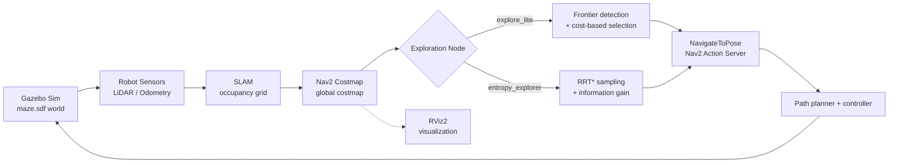

# 🧭 Autonomous Frontier & Entropy-Based Exploration for SLAM Mapping

[](https://docs.ros.org/en/jazzy/)
[](https://gazebosim.org/)
[](https://navigation.ros.org/)
[](LICENSE)

Autonomous exploration and mapping stack for a mobile robot navigating an **unknown environment**. The robot builds a map online using **SLAM**, identifies unexplored **frontiers** (boundaries between known-free and unknown space), and autonomously decides which one to visit next in order to maximize mapping coverage while minimizing wasted travel.

This repository contains two exploration strategies developed as part of my Master's practicum in Robotics and Automatic Control:

1. **Tuned `explore_lite`** — classic frontier-based exploration (cost = distance vs. frontier size), re-parameterized for environments with structured/walled rooms.
2. **`entropy_explorer`** — a custom exploration node I designed and implemented from scratch, combining **RRT\* sampling**, **Shannon-entropy-inspired information gain**, and a **structure-aware reward** that biases the robot toward unknown space near walls/obstacles instead of large open areas.

> 🎓 Developed for the *Robotics and Automatic Control* Master's practicum — SLAM & Autonomous Exploration module.

---

## 📽️ Demo

| Baseline (`explore_lite`, tuned) | Custom (`entropy_explorer`) |
|:---:|:---:|
|  |  |
| Full coverage of structured rooms, avoiding runaway exploration of open space | RRT* candidates (colored spheres = score) converging on unknown regions near walls |

---

## 📚 Table of Contents

- [Overview](#-overview)
- [System Architecture](#-system-architecture)
- [Method 1 — Tuned `explore_lite`](#-method-1--tuned-explore_lite)
- [Method 2 — Custom `entropy_explorer`](#-method-2--custom-entropy_explorer)
- [Repository Structure](#-repository-structure)
- [Requirements](#-requirements)
- [Installation](#-installation)
- [Usage](#-usage)
- [Parameters](#-parameters)
- [Results & Observations](#-results--observations)
- [Challenges & Lessons Learned](#-challenges--lessons-learned)
- [Future Work](#-future-work)
- [Author](#-author)
- [License](#-license)

---

## 🧩 Overview

The goal of this project is fully autonomous SLAM mapping of an unknown maze-like environment: no operator input, no pre-defined waypoints. The robot must:

1. Build an occupancy grid map online (SLAM).
2. Continuously detect **frontiers**: cells at the boundary between known-free and unknown space.
3. Score and select the next best goal to explore.
4. Send that goal to **Nav2** for path planning and execution.
5. Repeat until the map is sufficiently complete, then stop autonomously.

The stack is built on **ROS 2 Jazzy**, **Gazebo (Harmonic)** for simulation, and **Nav2** for global/local planning and control. The simulated robot follows the **B2W** bringup (wheeled quadruped-style platform), running in a maze world with a mix of open areas and enclosed rooms — a scenario specifically chosen to stress-test naive frontier selection.

---

## 🏗 System Architecture



Both exploration nodes plug into the same Nav2 `NavigateToPose` action interface, so they're interchangeable — the launch file decides which planner drives the robot.

---

## 🎯 Method 1 — Tuned `explore_lite`

Classic frontier-based exploration. For every detected frontier, a cost is computed:

```
C = potential_scale · d_min · r  −  gain_scale · N · r
```

- `d_min`: minimum Euclidean distance from the robot to the frontier
- `N`: frontier size (number of cells)
- `r`: map resolution (m/cell)
- Lower cost → frontier is selected first

**Finding:** the default parameters over-explore open space and neglect enclosed rooms, because large open frontiers dominate the size term. Parameters were re-tuned to force the robot to prioritize *structured*, walled areas:

| Parameter | Default | Tuned | Reasoning |
|---|---|---|---|
| `min_frontier_size` | 0.75 | **3.0** | Ignore sensor noise / tiny openings |
| `gain_scale` | 1.0 | **-0.75** | *Penalize* large frontiers to stop runaway open-space exploration |
| `potential_scale` | 3.0 | **3.5** | Prioritize nearby frontiers over distant ones |
| `progress_timeout` | 30.0 s | **25.0 s** | Faster recovery when a goal stalls |
| `planner_frequency` | 0.15 Hz | **0.05 Hz** | More deliberate replanning |

`orientation_scale` was also tested but has no effect, since orientation penalty is not implemented in `explore_lite`'s current codebase — a gap that directly motivated Method 2.

---

## 🧠 Method 2 — Custom `entropy_explorer`

To address `explore_lite`'s blind spot — no way to distinguish an "empty but large" frontier from a "small but structurally informative" one — I implemented a new exploration node from scratch: **structure-aware Next-Best-View (NBV) exploration with RRT\* candidate sampling**.

### Pipeline

1. **Candidate generation (RRT\*)** — grows a tree from the robot's current pose. With probability `rrt_goal_bias`, new samples are drawn from unknown ("no information") cells; otherwise sampling is uniform across the costmap. Nodes are connected with a max step (`rrt_step_size`) and rewired within a radius (`2 × rrt_step_size`) to keep paths efficient, RRT\*-style.
2. **Information gain estimation** — for each candidate, unknown cells inside a circular sensor footprint (`sensor_range`) are evaluated with a **Shannon-entropy** formulation (`H(p) = -p·log₂(p) - (1-p)·log₂(1-p)`), where unknown cells are treated as `p = 0.5` (maximum uncertainty).
3. **Structure-aware weighting** — unknown cells are split into two classes:

   - **near obstacles** (a wall/structure is within ~0.2 m) → weighted **5.0×**
   - **in open space** (no nearby structure) → weighted **0.05×**

   with a distance decay `w(d) = 1 / (1 + d)`:

   ```
   G(p) ∝ Σ_near-obstacles [5.0 · w(d)]  +  Σ_in-open [0.05 · w(d)]
   ```

   A logarithmic **structure bonus** amplifies candidates with enough nearby structure, and a **severe penalty (98%)** is applied when a candidate's gain comes mostly from open space — actively steering the robot away from featureless areas.

4. **Multi-objective goal selection** — the final score balances information gain against travel cost:

   ```
   S = info_gain_weight · G  −  distance_weight · (D / 10)
   ```

   The best-scoring, non-blacklisted candidate is sent to Nav2 as a `NavigateToPose` goal.

5. **Failure handling** — if progress stalls for `progress_timeout` seconds, the goal is blacklisted and the planner immediately re-evaluates candidates, avoiding repeated attempts at unreachable or misleading goals.

6. **Termination** — exploration stops automatically once the map is mostly known (`<8%` unknown cells) or frontier density drops below a threshold (`<1.5%`), sampled efficiently across the costmap.

### Why this beats plain frontier-based exploration (in this environment)

- **No runaway into empty space** — large open frontiers are explicitly de-weighted instead of implicitly favored by size.
- **Selects genuinely informative viewpoints** — biases toward walls/edges, which improves loop closure and map sharpness instead of blurry free-space growth.
- **More flexible than a single frontier centroid** — many sampled candidates mean the robot can always re-target if one region turns out unstable (e.g. the wall-disappearing bug above).
- **Graceful degradation** — blacklisting + periodic replanning avoids getting stuck retrying the same bad goal.

RViz visualization publishes all RRT\* candidates as colored spheres (red → yellow → green by score) with the selected goal highlighted in blue and a connecting line from the robot, making the decision process fully inspectable during a run.

---

## 📁 Repository Structure

```
    src/
    ├── Frontier-exploration/
    │   └── m-explore/
    │       ├── explore/                              # 🎯 Core exploration package (this project)
    │       │   ├── launch/
    │       │   │   ├── explore.launch.py             # Launches explore_lite (tuned frontier-based)
    │       │   │   └── entropy_explore.launch.py     # Launches entropy_explorer (custom NBV/RRT*)
    │       │   └── src/
    │       │       ├── costmap_client.cpp            # Costmap subscription + robot pose helper
    │       │       ├── frontier_search.cpp           # explore_lite: frontier detection + cost function
    │       │       ├── explore.cpp                   # explore_lite: main exploration node
    │       │       └── entropy_explorer.cpp          # 🎯 Custom RRT* + information-gain exploration node
    │       ├── frontier_exploration_manager/
    │       ├── frontier_exploration_manager_interfaces/
    │       └── map_merge/
    ├── Map-Conversion-3D-Voxel-Map-to-2D-Occupancy/
    ├── pecore_launch/                                # Bringup, launch files, robot sensors/behaviors
    └── qped_sim/                                     # Robot simulation (Gazebo, description, navigation)
```

---

## 🚀 Installation

```bash
# Create a workspace
mkdir -p ~/ros2_ws/src
cd ~/ros2_ws/src

# Clone this repo
git clone https://github.com/<your-username>/<your-repo-name>.git

# Install dependencies
cd ~/ros2_ws
rosdep install --from-paths src --ignore-src -r -y

# Build
colcon build --symlink-install
source install/setup.bash
```

---

## ▶️ Usage

**1. Launch the full simulation stack** (Gazebo + robot + SLAM/perception + fake localization + Nav2):

```bash
ros2 launch pecore_launch simulation.launch.py
```

**2. Launch the exploration node** of your choice, in a second terminal:

```bash
# Tuned frontier-based exploration (explore_lite)
ros2 launch explore_lite explore.launch.py

# OR: custom entropy/NBV exploration
ros2 launch explore_lite entropy_explore.launch.py
```

**3. Visualize** in RViz2 using `rviz/simulation.rviz` — includes the occupancy grid, Nav2 costmaps, and (for `entropy_explorer`) the live RRT\* candidate markers.

---

## 🔧 Parameters

### `entropy_explorer` (custom node)

| Parameter | Default | Description |
|---|---|---|
| `planner_frequency` | `1.0` | Planning loop rate (Hz) |
| `progress_timeout` | `30.0` | Seconds before a stalled goal is blacklisted |
| `visualize` | `true` | Publish RViz candidate markers |
| `return_to_init` | `false` | Return to start pose when exploration finishes |
| `rrt_samples` | `100` | Nodes generated per RRT\* tree expansion |
| `rrt_step_size` | `2.0` | Max distance between connected RRT\* nodes (m) |
| `rrt_goal_bias` | `0.15` | Probability of sampling directly from unknown cells |
| `sensor_range` | `5.0` | Radius used to estimate information gain (m) |
| `info_gain_weight` | `2.0` | Weight of information gain in the final score |
| `distance_weight` | `1.0` | Weight of travel distance in the final score |
| `min_information_gain` | `0.5` | Minimum gain for a candidate to be considered valid |

### `explore_lite` (tuned baseline)

| Parameter | Default | Tuned |
|---|---|---|
| `min_frontier_size` | 0.75 | 3.0 |
| `gain_scale` | 1.0 | -0.75 |
| `potential_scale` | 3.0 | 3.5 |
| `progress_timeout` | 30.0 | 25.0 |
| `planner_frequency` | 0.15 | 0.05 |

---

